# 🌊 HydroVexel - AI-Powered Oil Spill Detection System

[](https://hydrovexel.streamlit.app/)
[](https://www.python.org/)
[](https://www.tensorflow.org/)
[](https://streamlit.io/)
[](LICENSE)

> **AI-Powered Protection for Our Oceans ✨**

An AI system that detects oil spills from satellite imagery with **94.57% accuracy**. Built for the **GDG Noida Build-a-thon** to help protect marine environments through rapid detection and response.

---

## 🌐 **[Try HydroVexel Live](https://hydrovexel.streamlit.app/)**
🎥 **Demo Video:** [Click Here to Watch](https://drive.google.com/drive/folders/1cru23V5h5avZuVgT1UBg6zuYQGnc94WT?usp=drive_link)

[](https://drive.google.com/drive/folders/1cru23V5h5avZuVgT1UBg6zuYQGnc94WT?usp=drive_link)


<br><br>

## 📋 Table of Contents

- [About](#-about)
- [Why This Matters](#-why-this-matters)
- [Key Features](#-key-features)
- [Technology Stack](#-technology-stack)
- [Model Performance](#-model-performance)
- [Quick Start](#-quick-start)
- [How to Use](#-how-to-use)
- [Results](#-results)
- [Future Plans](#-future-plans)
- [About the Developer](#-about-the-developer)
- [Acknowledgments](#-acknowledgments)

---

## 🎯 About

**HydroVexel** is an AI-powered oil spill detection system developed for the **GDG Noida Build-a-thon**. It uses deep learning to analyze satellite images and instantly identify oil spills in our oceans.

### Why This Matters

Oil spills threaten:
- 🐋 **Marine Life** - Kills fish, mammals, and birds
- 🏖️ **Coastlines** - Pollutes beaches and shores
- 💰 **Economies** - Damages fishing and tourism
- 🌍 **Environment** - Long-term ecological damage 

Traditional detection is slow and manual. **HydroVexel** provides instant, accurate detection for faster response.

---

## ✨ Key Features

- **🎯 Real-time Detection** - Upload images, get instant results
- **📊 94.57% Accuracy** - Powered by U-Net + Attention architecture
- **🗺️ Visual Analysis** - Heatmaps, overlays, and confidence scores
- **☁️ Cloud Storage** - Save and track detections over time
- **📱 Easy to Use** - Simple web interface, no installation needed
- **🌊 Beautiful UI** - Ocean-themed design with smooth animations

---
## 🧠 System Architecture

HydroVexel follows a modular pipeline for accurate oil spill detection:

**Architecture Overview:**
[System Architecture](outputs/system-architecture.png)

- **Preprocessing:** Image resizing, normalization, and augmentation  
- **Model:** U-Net with Attention Gates for segmentation  
- **Post-Processing:** Thresholding and mask refinement  
- **Visualization:** Detection overlays, confidence maps, and dashboards  
- **Database:** Supabase cloud storage for historical tracking  

## 🛠️ Technology Stack

**AI & Machine Learning:**
- TensorFlow 2.19 & Keras - Deep learning
- PyTorch 2.0 - Model development
- U-Net + Attention Gates - Architecture

**Data Processing:**
- NumPy & Pandas - Data handling
- OpenCV - Image processing
- Matplotlib & Seaborn - Visualizations

**Web App:**
- Streamlit - Web interface
- Supabase - Database & storage
- Python 3.10 - Backend

---

## 📊 Model Performance

| Metric | Score |
|--------|-------|
| **Accuracy** | 94.57% |
| **Precision** | 96.22% |
| **Recall** | 94.69% |
| **F1-Score** | 95.45% |
| **Dice Coefficient** | 0.8984 |

### What This Means:
- ✅ Detects 95% of actual oil spills
- ✅ Very few false alarms (96% precision)
- ✅ Reliable for real-world use

---

## 🚀 Quick Start

### Option 1: Use the Live App (Recommended)
Just visit: [https://hydrovexel.streamlit.app/](https://hydrovexel.streamlit.app/)

### Option 2: Run Locally

1. **Clone the repo**
```bash
git clone https://github.com/simplysandeepp/Oil-Spill-Detection
cd hydrovexel
```

2. **Install dependencies**
```bash
pip install -r requirements.txt
```

3. **Run the app**
```bash
streamlit run streamlit_app.py
```

4. **Open in browser**
```
http://localhost:8501
```

---

## 💡 How to Use

### Simple Steps:

1. **Visit the Website** → [hydrovexel.streamlit.app](https://hydrovexel.streamlit.app/)

2. **Upload Image** → Drag & drop or browse (JPG/PNG)

3. **Adjust Settings** (optional)
   - Confidence threshold
   - Overlay transparency

4. **Click "DETECT"** → AI analyzes the image

5. **View Results**
   - Detection overlay
   - Confidence heatmap
   - Binary mask
   - Coverage statistics

6. **Explore History** → View past detections and gallery

---

## 🎨 Results

### Dataset Distribution
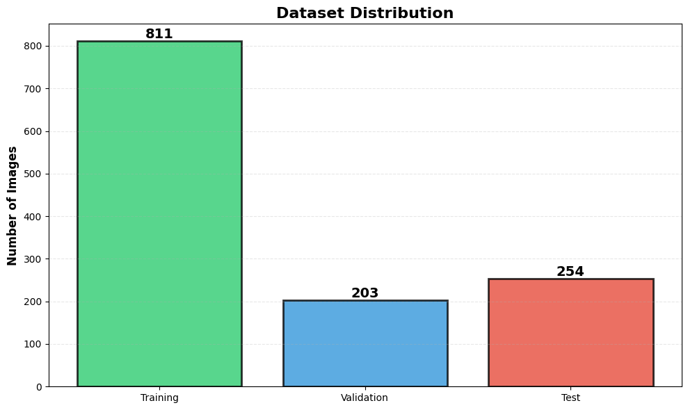

### Dataset Loading
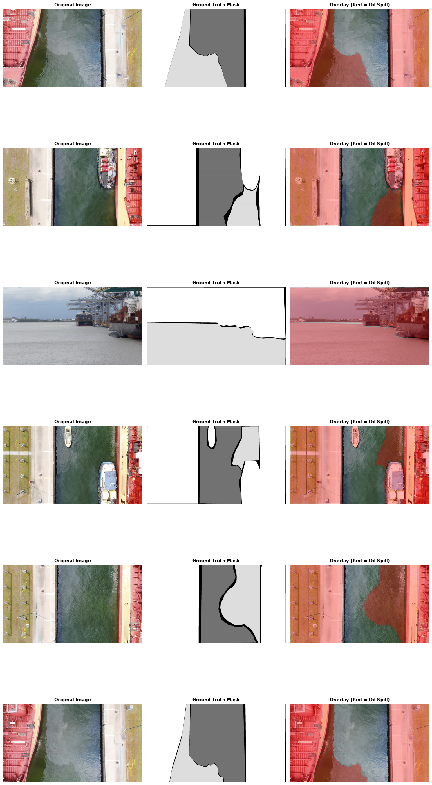

### Oil Spill Distribution
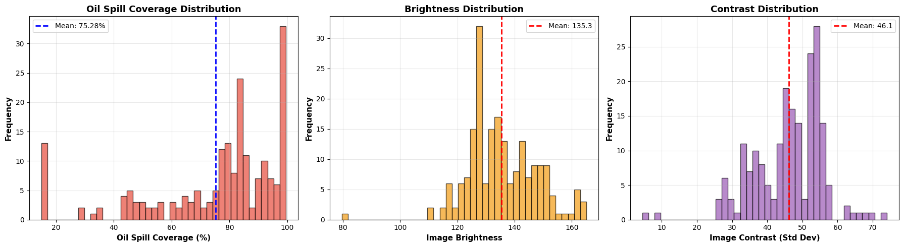

### Model Architecture
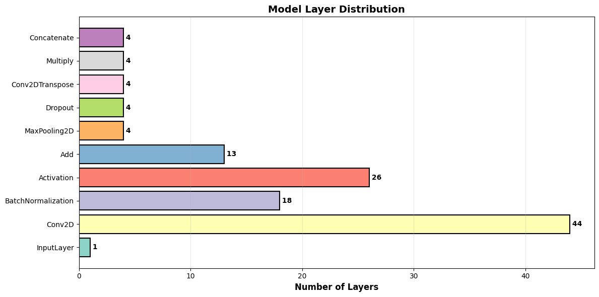

### Training Progress
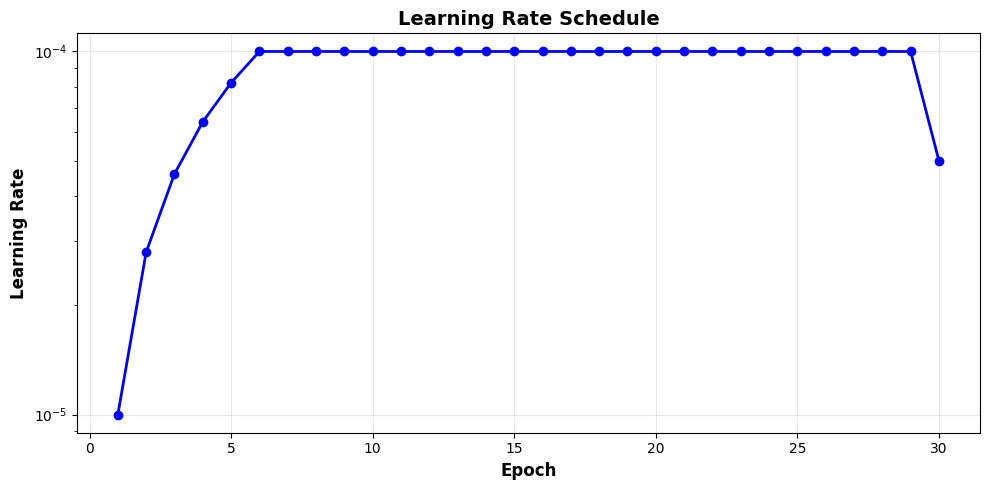

### Performance Metrics
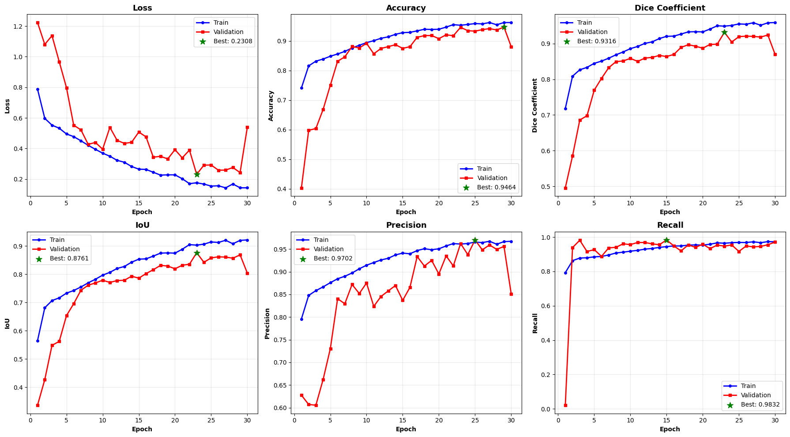

### Confusion Matrix
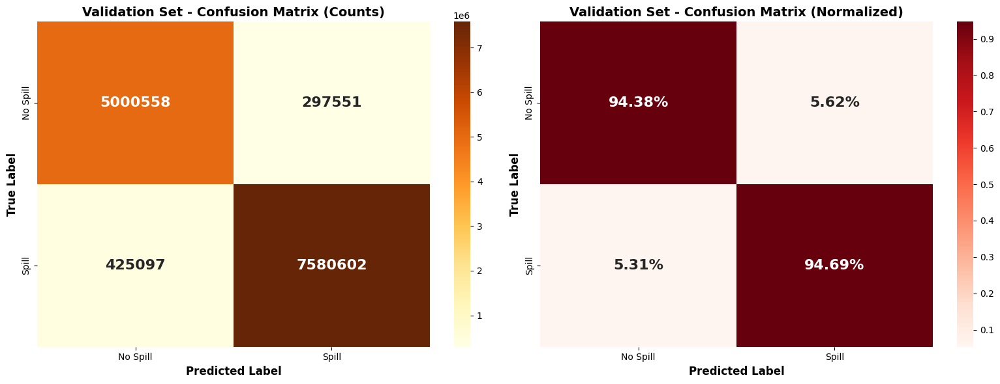

### Quality Heatmap
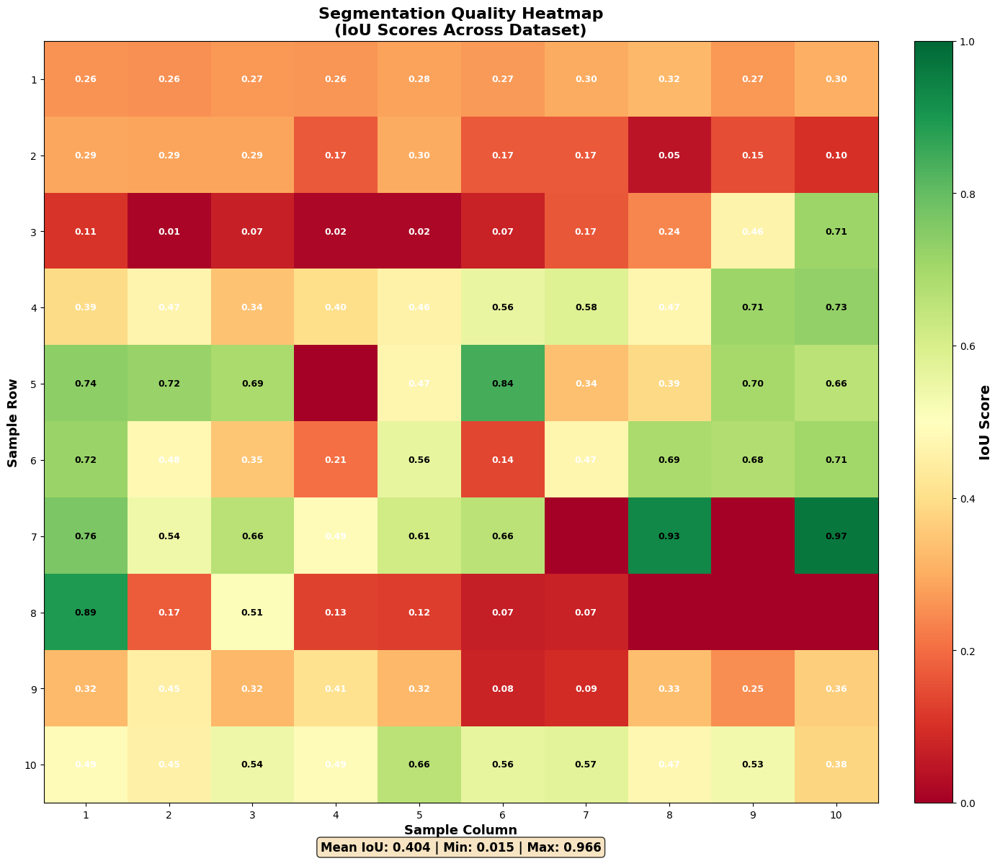

### Model Predictions
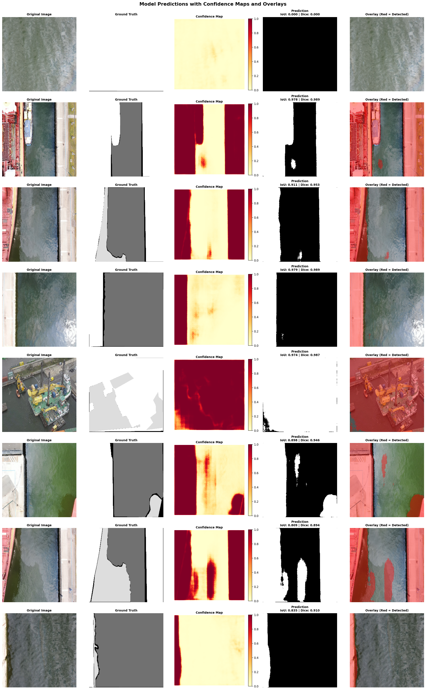

### Best vs Worst Predictions
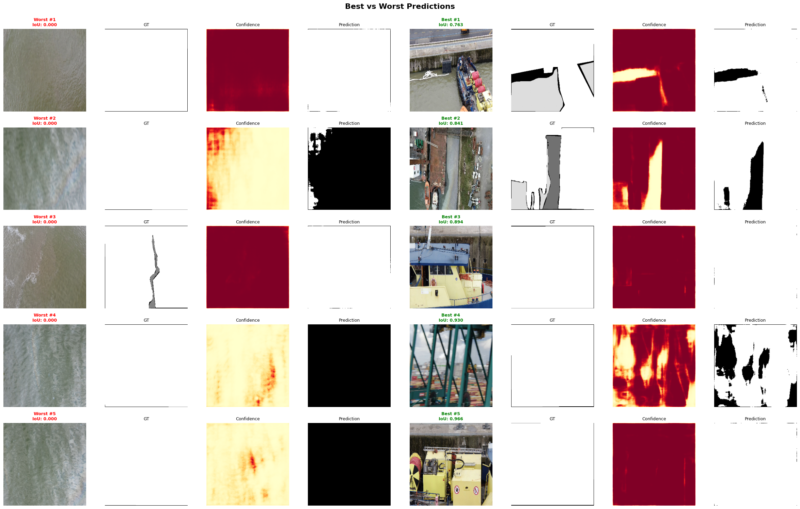

### Application Screenshots

**Landing Page**
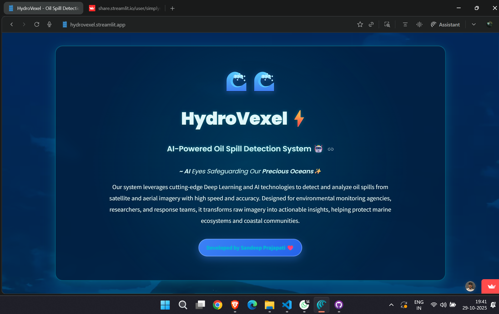

**Oil Spill Information**
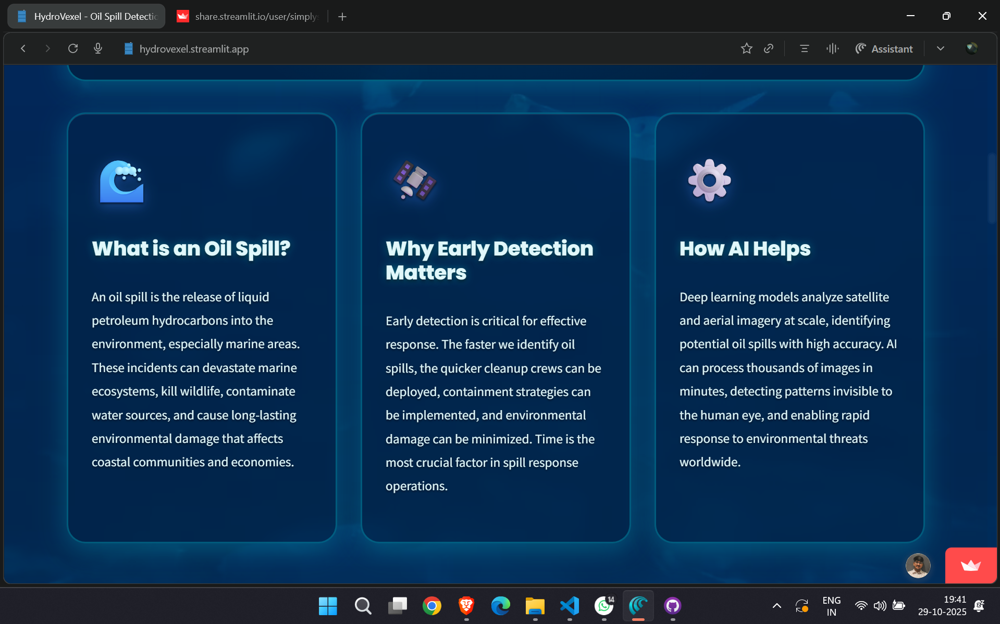

**Upload Interface**
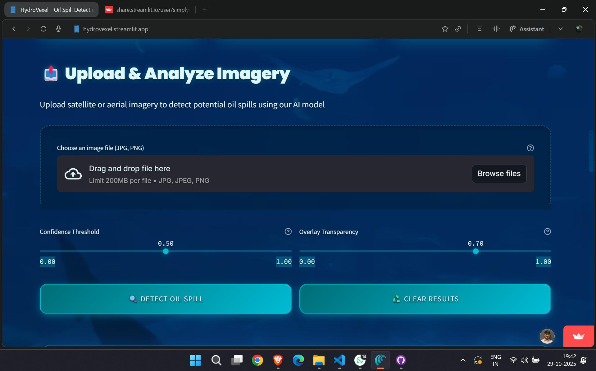

**Detection Results**


**Analysis Dashboard**
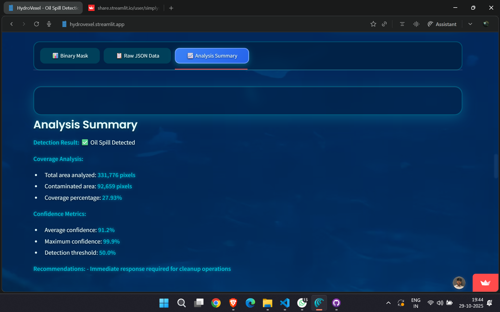

**Live Database**
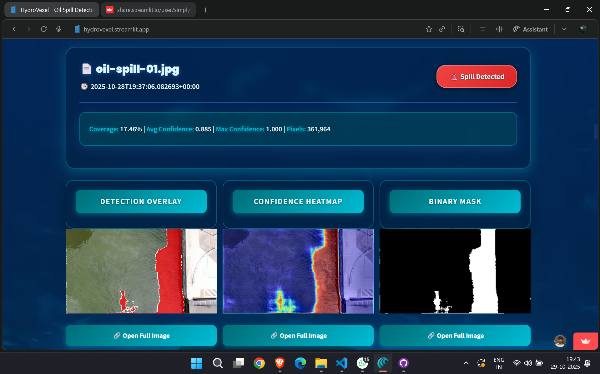

**Detection History**
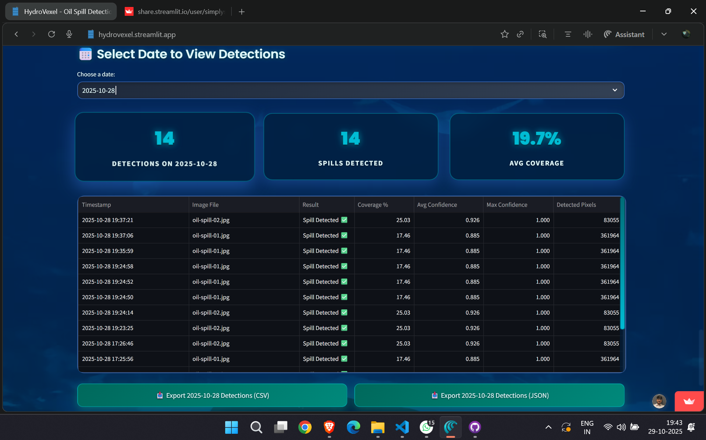

---

## 🔮 Future Plans

- 🛰️ **Real-time Satellite Integration** - Automatic monitoring
- 📈 **Time-series Analysis** - Track spill evolution
- 📱 **Mobile App** - iOS and Android versions
- 🌍 **Multi-language Support** - Reach more users
- 🔔 **Alert System** - Instant notifications
- 📊 **Advanced Reports** - Automated report generation

---

## 👥 Team

### Project Lead: Sandeep Prajapati

**AI Enthusiast | Environmental Tech Developer**

Built for **GDG Noida Build-a-thon** to combine AI with environmental protection.

**Education:** B.Tech in CSE (AI & ML) - Galgotias University (2023-2027)

**Roles:**
- Google Student Ambassador
- GSSOC'25 Mentor
- Core Member @ GDG OC GU
- Super Contributor @ Hacktoberfest'25

## Connect:
### Team Members

[](mailto:sandeepprajapati1202@gmail.com)

**Siya Kumari**
[](mailto:siyak3858@gmail.com)

**Khushi Rawat**
[](mailto:rawatkhushi004@gmail.com)

**Vansh Chhabra**
[](mailto:vanshchhabra830@gmail.com)

---

## 🙏 Acknowledgments

**Built For:**
- **GDG Noida Build-a-thon** - Project motivation and platform

**Special Thanks:**
- **GDG Noida Community** - Support and guidance
- **Galgotias University** - Academic resources

**Data & Tools:**
- [Zenodo Dataset](https://zenodo.org/records/10555314) - Training data
- TensorFlow & Streamlit - Development frameworks
- Supabase - Cloud infrastructure

---

## 📜 License

MIT License - See [LICENSE](LICENSE) file

---

*Built with ❤️ for GDG Noida Build-a-thon | Protecting Our Oceans with AI*


<br><br>